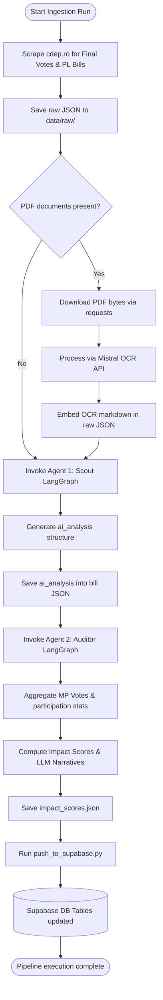
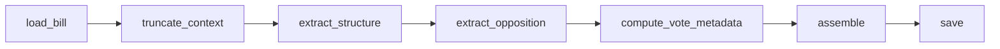
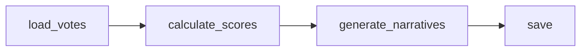
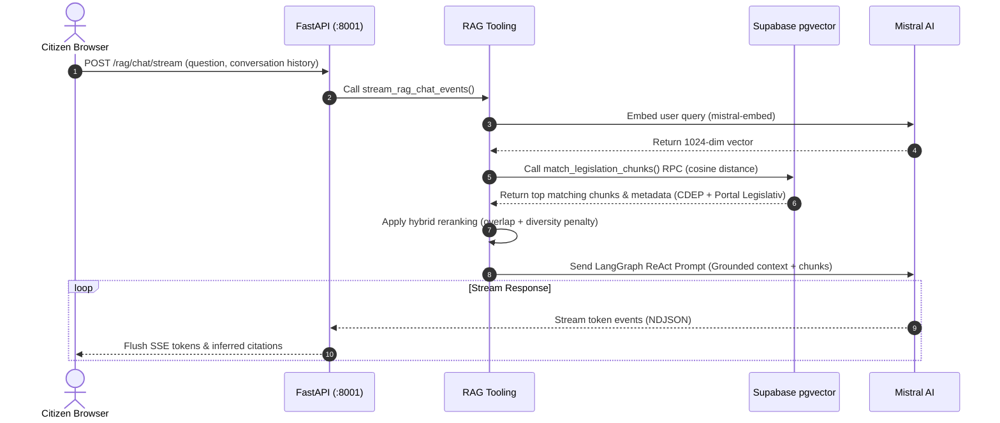
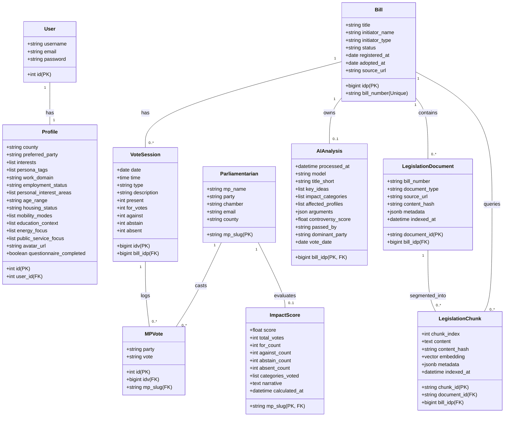

# 🏛️ CivicMind System Architecture & Design References

This document outlines the component architecture, ingestion pipelines, agentic execution workflows, and data models of the **CivicMind** platform.

---

## 🧱 1. Component Architecture

CivicMind is designed as a modular civic-tech platform split into three primary layers, communicating with a shared data store.

```mermaid
flowchart TB
    subgraph Frontend ["💻 CITIZEN FRONTEND (React + Vite)"]
        SPA["React SPA (frontend/)"]
        Router["TanStack Router (Routing)"]
        Query["TanStack Query (Data Fetching)"]
        Tailwind["Tailwind CSS (UI & Theme)"]
        SPA --> Router
        SPA --> Query
        SPA --> Tailwind
    end

    subgraph BackendGateway ["🔒 BACKEND GATEWAY (Django 6.0)"]
        Django["Django App (backend/)"]
        DRF["Django REST Framework (DRF)"]
        AuthService["Authentication Service (Token / Google OAuth)"]
        ProfileService["Profile Service (Questionnaires & Derivations)"]
        Django --> DRF
        Django --> AuthService
        Django --> ProfileService
    end

    subgraph AIService ["🧠 AI & AGENT SERVICE (FastAPI)"]
        FastAPI["FastAPI App (legislative-intelligence/)"]
        Scraper["Legislation Scrapers (cdep.ro / SOAP legislatie.just.ro)"]
        LangGraph["LangGraph Workflow Engine (Multi-Agent)"]
        RAG["RAG Semantic Engine (Mistral Embeddings)"]
        FastAPI --> Scraper
        FastAPI --> LangGraph
        FastAPI --> RAG
    end

    subgraph DB ["💾 DATABASE & CORPUS LAYER (Supabase / Postgres)"]
        PG["PostgreSQL DB"]
        PGVector["pgvector Extension (HNSW Indexing)"]
        RPC["match_legislation_chunks() SQL RPC"]
    end

    %% Interactions
    SPA -- "HTTP /api (Proxy)" --> Django
    SPA -- "HTTP /mps, /rag, /qa (API)" --> FastAPI
    Django -- "psycopg2 Pooler" --> PG
    FastAPI -- "SQL / REST Client" --> DB
    Scraper -- "Mistral OCR 3" --> FastAPI
```

---

## 🔁 2. Core Processing Workflows

### 📥 Data Ingestion & Enrichment Pipeline
This workflow processes raw government data and runs agentic steps to output clean legislative insights.

---

### 🤖 LangGraph Multi-Agent Nodes

#### Agent 1: Legislative Scout (`agents/scout.py`)
Analyzes raw bill data and explanatory memorandums, producing short titles, key ideas, impact profiles, and arguments.

#### Agent 2: Political Auditor (`agents/auditor.py`)
Computes parliamentarians' participation/decisiveness scores and calls Mistral to write custom narrative overviews.

---

### 🔍 RAG Retrieval & Streaming Chat Flow
How similarity search is executed over the vector database and streamed in real-time to the citizen's browser.

---

## 📊 3. UML Data Schema (Supabase ERD)

This class diagram represents the database tables, fields, and relational layout inside Supabase Postgres.

