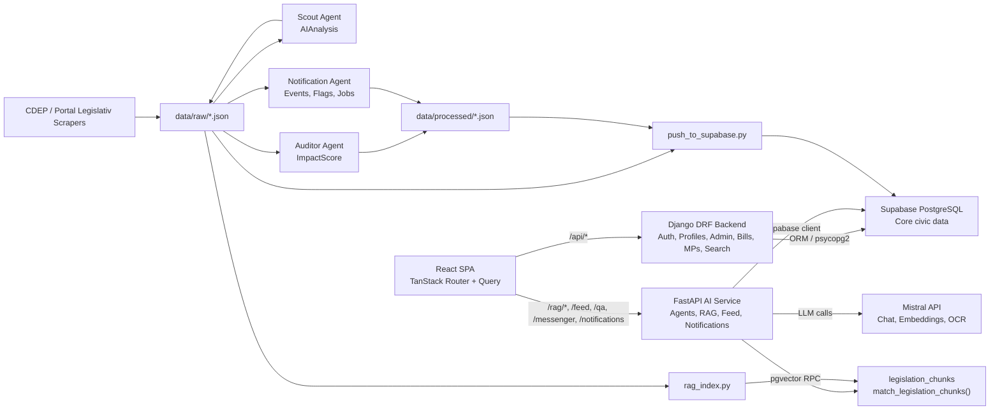
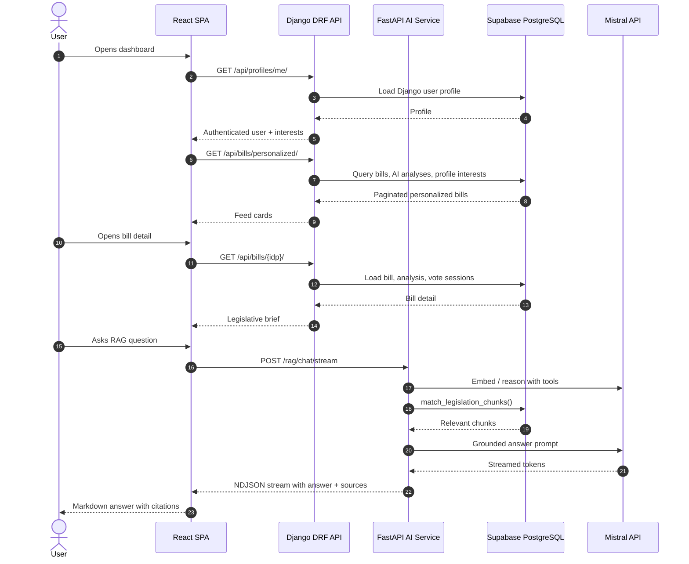
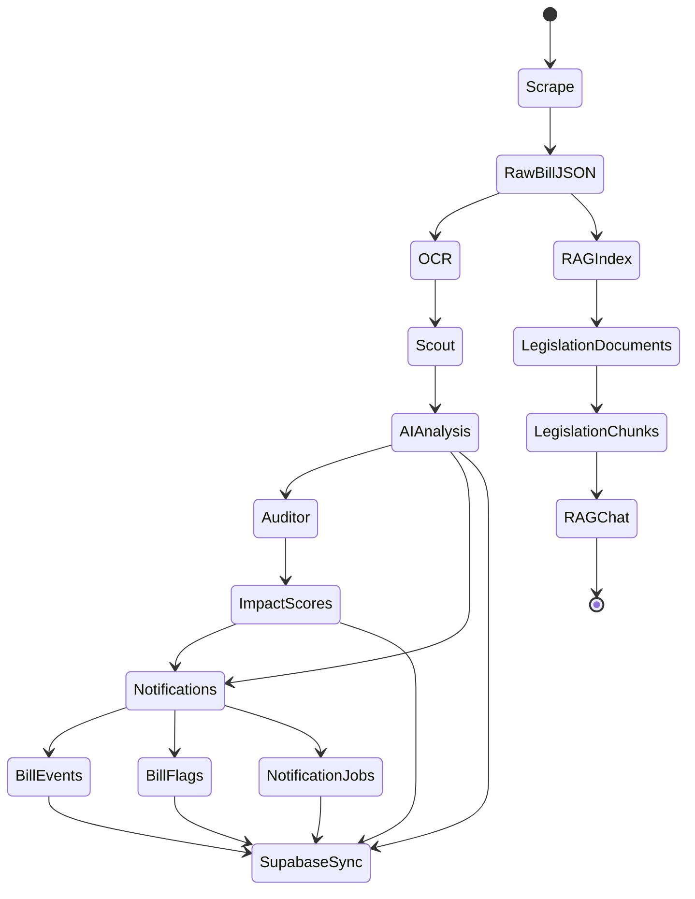

# CivicMind UML Diagrams

This document describes the current application structure as implemented in the repository.

The system is a monorepo with three runtime surfaces:
- React/Vite frontend in `frontend/`
- Django/DRF backend in `backend/`
- FastAPI AI service in `legislative-intelligence/`

Important current boundary:
- Django owns authenticated user/profile/admin APIs under `/api/*`.
- FastAPI owns agents, RAG, feed helpers, notification helpers, and local/Supabase AI tooling.
- Some profile concepts exist in both Django and FastAPI/Supabase. This is intentional in the current code, but should be unified later.

## Domain Class Diagram

```mermaid
classDiagram
    direction LR

    class DjangoUser {
        +int id
        +string username
        +string email
        +string password
    }

    class Profile {
        +int id
        +string county
        +string preferred_party
        +list interests
        +list persona_tags
        +string work_domain
        +string employment_status
        +list personal_interest_areas
        +string age_range
        +string housing_status
        +list mobility_modes
        +list education_context
        +list energy_focus
        +list public_service_focus
        +string avatar_url
        +bool questionnaire_completed
        +update_derived_fields()
    }

    class Bill {
        +int idp
        +string bill_number
        +text title
        +string initiator_name
        +string initiator_type
        +string status
        +string procedure
        +string law_type
        +string decision_chamber
        +date registered_at
        +date adopted_at
        +url source_url
        +url doc_expunere_url
        +url doc_forma_url
        +text ocr_expunere
        +text ocr_aviz_ces
        +text ocr_aviz_cl
    }

    class AIAnalysis {
        +int bill_idp
        +datetime processed_at
        +string model
        +string title_short
        +float controversy_score
        +string passed_by
        +string dominant_party
        +date vote_date
        +string ocr_quality
        +float confidence
    }

    class ImpactCategory {
        +int id
        +string name
        +string slug
        +text description
    }

    class AffectedProfile {
        +int id
        +string name
        +string slug
        +text description
    }

    class KeyIdea {
        +int id
        +text text
        +int order
    }

    class BillArgument {
        +int id
        +string type
        +text text
        +int order
    }

    class VoteSession {
        +int idv
        +string type
        +date date
        +string time
        +text description
        +int present
        +int for_votes
        +int against
        +int abstain
        +int absent
    }

    class PartyVoteResult {
        +int id
        +string party
        +int for_votes
        +int against
        +int abstain
        +int absent
    }

    class Parliamentarian {
        +string mp_slug
        +string mp_name
        +string party
        +string chamber
        +string email
        +string county
    }

    class MPVote {
        +int id
        +string party
        +string vote
    }

    class ImpactScore {
        +string mp_slug
        +float score
        +int total_votes
        +int for_count
        +int against_count
        +int abstain_count
        +int absent_count
        +list categories_voted
        +text narrative
        +datetime calculated_at
    }

    class BillEvent {
        +string event_key
        +string event_type
        +int idv
        +string bill_number
        +string source
        +string chamber
        +date vote_date
        +json summary
        +datetime detected_at
    }

    class BillFlag {
        +string event_key
        +int idv
        +string bill_number
        +string event_type
        +string importance
        +list flags
        +datetime classified_at
    }

    class SupabaseUserProfile {
        +string user_id
        +string display_name
        +string auth_provider
        +string city
        +string county
        +string constituency
        +string occupation
        +string sector
        +list roles
        +list interests
        +list affected_profiles
        +list followed_bills
        +list followed_mps
        +string language
        +string explanation_preference
    }

    class NotificationPreference {
        +string user_id
        +list categories
        +list profiles
        +list flags
        +string frequency
        +string min_importance
        +bool major_alerts
    }

    class NotificationJob {
        +string job_id
        +string event_key
        +string user_id
        +string email
        +string status
        +string frequency
        +string importance
        +list matched_flags
        +string subject
        +text body
    }

    class LegislationDocument {
        +string document_id
        +string source
        +string external_id
        +int bill_idp
        +string bill_number
        +string title
        +string document_type
        +url source_url
        +string content_hash
        +json metadata
        +datetime indexed_at
    }

    class LegislationChunk {
        +string chunk_id
        +string document_id
        +string source
        +string external_id
        +int bill_idp
        +int chunk_index
        +text content
        +string content_hash
        +vector embedding
        +json metadata
        +datetime indexed_at
    }

    DjangoUser "1" -- "1" Profile : owns

    Bill "1" -- "0..1" AIAnalysis : analyzed_by
    AIAnalysis "1" -- "0..*" KeyIdea : has
    AIAnalysis "1" -- "0..*" BillArgument : has
    AIAnalysis "0..*" -- "0..*" ImpactCategory : tagged_with
    AIAnalysis "0..*" -- "0..*" AffectedProfile : affects

    Bill "1" -- "0..*" VoteSession : has
    VoteSession "1" -- "0..*" PartyVoteResult : aggregates
    VoteSession "1" -- "0..*" MPVote : records
    Parliamentarian "1" -- "0..*" MPVote : casts
    Parliamentarian "1" -- "0..1" ImpactScore : scored_by

    Bill "1" -- "0..*" BillEvent : produces
    BillEvent "1" -- "0..1" BillFlag : classified_as
    BillEvent "1" -- "0..*" NotificationJob : queues
    SupabaseUserProfile "1" -- "0..1" NotificationPreference : configures
    SupabaseUserProfile "1" -- "0..*" NotificationJob : receives

    Bill "1" -- "0..*" LegislationDocument : indexes
    LegislationDocument "1" -- "1..*" LegislationChunk : split_into
    Bill "0..1" -- "0..*" LegislationChunk : referenced_by
```

## Runtime Component Diagram

## Main User Flow Sequence

## Agent Workflow Diagram

## Current Architecture Notes

- The frontend currently calls Django for `/api/bills`, `/api/mps`, `/api/profiles`, `/api/search`, and `/api/auth`.
- The frontend calls FastAPI for `/rag`, `/qa`, `/messenger`, `/feed`, and `/notifications`.
- The FastAPI onboarding endpoint is `/profiles/analyze-onboarding`; this requires either `VITE_AI_SERVICE_URL=http://localhost:8001` or a proxy rule for `/profiles` that points to FastAPI.
- Django `Profile` and FastAPI/Supabase `user_profiles` overlap conceptually. They should eventually be unified or clearly separated as "auth profile" vs "personalization profile".
- Scraper/API-key-dependent paths were not executed during this documentation pass.

