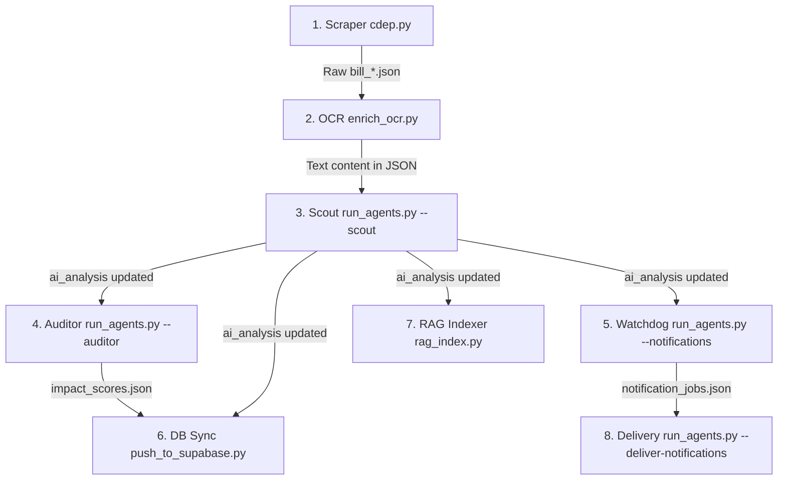

# Orchestration Guide: Legislative Intelligence Processing & Agents

This guide explains how the different scripts and agents inside the `legislative-intelligence` module are orchestrated to process, analyze, and catalog Romanian legislative data after it has been scraped.

---

## Data Flow & Pipeline Overview

Once the scraper has pulled the raw voting and bill data from `cdep.ro` (generating `data/raw/bill_*.json` files), the pipeline processes the data in the following chronological sequence:



---

## 1. Document OCR Enrichment

Many documents from `cdep.ro` are scanned image PDFs (not searchable text). The OCR step downloads these PDFs and uses the Mistral OCR API to extract markdown text.

### What it does:
- Scans `data/raw/bill_*.json` for bills containing document URLs but missing `ocr_content` fields.
- Downloads PDF bytes, uploads them to the Mistral Files API, requests OCR processing via `mistral-ocr-latest`, and updates the bill's JSON file inline.

### How to run:
```bash
python enrich_ocr.py
```

---

## 2. Legislative Scout (Agent 1)

The **Scout** parses the OCR text of the bill (specifically `expunere_de_motive` and any committee opinions `aviz_ces`, `aviz_cl`) to build a structured AI summary of the bill.

### What it does:
- Runs a multi-node LangGraph pipeline.
- Uses `mistral-small-latest` in JSON mode to extract:
  - `title_short` (max 8-word friendly title)
  - `key_ideas` (list of core bullet points)
  - `impact_categories` (e.g. `sanatate`, `fiscal`, `justitie`)
  - `affected_profiles` (e.g. `angajat`, `pacient`, `antreprenor`)
  - `pro` arguments and `con` arguments.
- Appends vote telemetry metadata (e.g. controversy score, dominant voting party).
- Saves this structure inside the `"ai_analysis"` field of the bill JSON.

### How to run:
- **Process all bills in parallel** (using 4 worker threads):
  ```bash
  python run_agents.py --scout --workers 4
  ```
- **Process a single bill** (for testing):
  ```bash
  python run_agents.py --scout --file bill_23048.json
  ```

---

## 3. Political Auditor (Agent 2)

The **Auditor** aggregates voting data across all processed bills to evaluate individual Member of Parliament (MP) behavior and calculate impact ratings.

### What it does:
- Loads all `nominal_votes` records from every `bill_*.json` on disk.
- Calculates a political participation and decisiveness rating using the formula:
  $$\text{Score} = (\text{Participation} \times 0.6 + \text{Decisiveness} \times 0.4) \times 100$$
  - $\text{Participation} = \frac{\text{total votes} - \text{absent votes}}{\text{total votes}}$
  - $\text{Decisiveness} = \frac{\text{for votes} + \text{against votes}}{\text{total votes}}$
- Invokes `mistral-small-latest` to generate a 2-sentence narrative summarizing the MP's overall alignment (if they have voted on at least 3 bills).
- Saves the aggregated metrics and narratives to [data/processed/impact_scores.json](file:///c:/Users/Matei/Desktop/civicmind/legislative-intelligence/data/processed/impact_scores.json).

### How to run:
```bash
python run_agents.py --auditor
```

---

## 4. RAG Indexer

The **RAG Indexer** builds semantic vector search embeddings for both local bills and historical national legislation so that the chat assistant can search across the entire corpus.

### What it does:
- Connects to Supabase Postgres (using `pgvector`) and Mistral Embeddings API (`mistral-embed`).
- Chunks legislative text (bills, OCR PDFs, and SOAP-scraped Portal Legislativ Acts) into overlapping parts.
- Generates 1024-dimensional vector embeddings and uploads them to the database.
- Uses content hashing to skip unchanged documents incrementally.

### How to run:
- **Index local bills**:
  ```bash
  python rag_index.py --source bills --all --changed-only
  ```
- **Index Portal Legislativ (2025 slice)**:
  ```bash
  python rag_index.py --source legislatie-just --year 2025 --limit 100 --changed-only
  ```

---

## 5. Supabase Data Sync

This utility pushes all structured local JSON records (bills, votes, nominal sessions, impact scores) into their matching relational tables in the Supabase PostgreSQL database.

### What it does:
- Parses local JSON file data.
- Batch upserts into Supabase tables: `bills`, `vote_sessions`, `party_vote_results`, `mp_votes`, `ai_analyses`, `impact_scores`, and `parliamentarians`.

### How to run:
```bash
python db/push_to_supabase.py
```

---

## 6. Watchdog & Notification Delivery (Agent 5)

A deterministic pipeline that detects major legislative milestones, matches them against opt-in user preferences, and stages email alerts.

### What it does:
- **Watchdog (`--notifications`)**: Scans bill files for new events (e.g. `new_bill`, `new_final_vote`, `analysis_created`), applies tags (e.g. `narrow_vote`, `high_controversy`, `category:sanatate`), filters them against preferences in `notification_preferences.json`, and appends drafts to `notification_jobs.json`.
- **Delivery (`--deliver-notifications`)**: Processes the staged notification jobs, simulates delivery in dry-run mode, and updates the outbox registry.

### How to run:
- **Run the watchdog scan**:
  ```bash
  python run_agents.py --notifications --preferences notification_preferences.example.json
  ```
- **Process delivery jobs** (dry-run):
  ```bash
  python run_agents.py --deliver-notifications
  ```

---

## Interactive Playground Scripts

For testing the AI agents directly from the command line:

### Civic Q&A (Agent 3)
Allows you to ask freeform Romanian questions about a specific bill, referencing the bill's key ideas and OCR text context.
```bash
python run_agents.py --qa --file bill_23048.json
```

### Civic Messenger (Agent 4)
Generates a formal, polite email draft from a citizen to their elected MP expressing support or opposition based on the bill's key impact details.
```bash
python run_agents.py --messenger --file bill_23048.json
```
